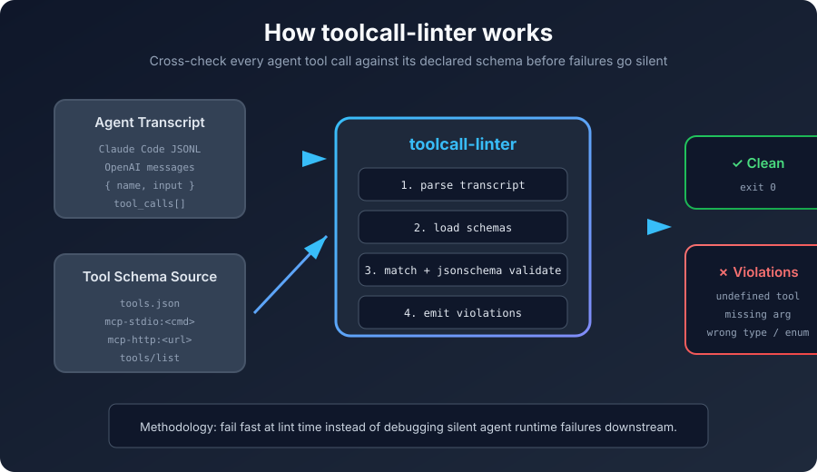
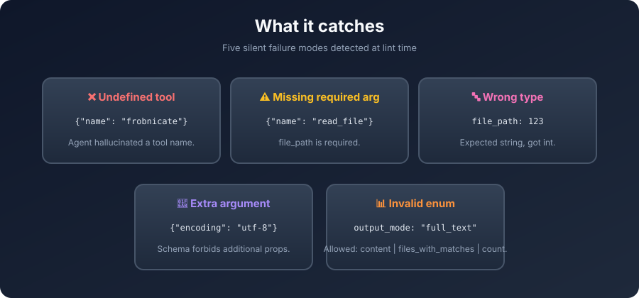
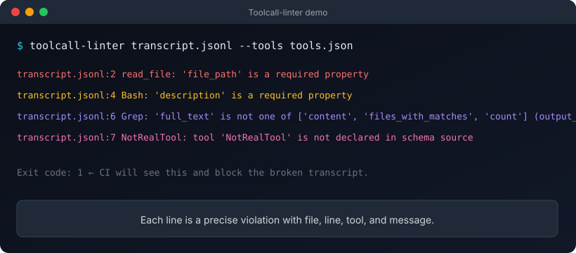

<p align="center">
  
</p>

<h1 align="center"> toolcall-linter </h1>

<p align="center">
  <strong>Local, offline, read-only linter that cross-checks agent transcript tool calls against declared schemas.</strong>
</p>

<p align="center">
  <a href="#install">Install</a> •
  <a href="#quick-start">Quick Start</a> •
  <a href="#methodology">Methodology</a> •
  <a href="#supported-formats">Formats</a> •
  <a href="#ci">CI</a>
</p>

<p align="center">
  
  
  
  
</p>

---

## What problem does this solve?

AI agents call tools hundreds of times per session. When an agent passes a **wrong argument type**, **forgets a required parameter**, or **hallucinates a tool name**, the failure often surfaces far downstream as a confusing runtime error. Debugging those failures means manually tracing through logs and comparing tool calls against schemas.

**toolcall-linter** makes those mistakes visible *immediately*, at lint time, with a single command.

```bash
toolcall-linter transcript.jsonl --tools tools.json
```

It reads the agent transcript, loads the declared tool schemas, validates every call against JSON Schema, and reports exactly where the contract is broken.

---

## How it works

<p align="center">
  
</p>

1. **Parse the transcript** — accepts Claude Code JSONL or OpenAI messages arrays.
2. **Load the schema source** — `tools.json`, an MCP server over stdio (`mcp-stdio:<cmd>`), or HTTP (`mcp-http:<url>`).
3. **Match and validate** — every tool call is looked up by name and validated with `jsonschema`.
4. **Report violations** — line-precise errors in text or JSON, with a nonzero exit code when anything fails.

---

## What it catches

<p align="center">
  
</p>

| Failure class | Example | Why it matters |
|---|---|---|
| **Undefined tool** | `{"name": "frobnicate"}` | Agent invented a tool that does not exist in the schema. |
| **Missing required argument** | `read_file` without `file_path` | Runtime call will fail or read the wrong thing. |
| **Wrong type** | `file_path: 123` | String path expected, integer received. |
| **Extra argument** | `read_file` with `encoding: "utf-8"` | Schema forbids additional properties; agent is drifting. |
| **Invalid enum value** | `output_mode: "full_text"` | Agent picked a mode the tool does not support. |

---

## Install

<a name="install"></a>

```bash
# Recommended: install with pipx (isolated, global CLI)
pipx install .
pipx install git+https://github.com/Victorchatter/toolcall-linter

# Or in a local venv
python -m venv .venv
source .venv/bin/activate  # .venv\Scripts\activate on Windows
pip install -e .
```

No network calls, no telemetry, no credentials required.

---

## Quick start

<a name="quick-start"></a>

Create a `tools.json` with the schemas your agent is supposed to respect:

```json
{
  "tools": [
    {
      "name": "read_file",
      "inputSchema": {
        "type": "object",
        "properties": {
          "file_path": { "type": "string" },
          "limit": { "type": "integer", "minimum": 1 }
        },
        "required": ["file_path"],
        "additionalProperties": false
      }
    },
    {
      "name": "Bash",
      "inputSchema": {
        "type": "object",
        "properties": {
          "command": { "type": "string", "minLength": 1 },
          "description": { "type": "string" }
        },
        "required": ["command", "description"],
        "additionalProperties": false
      }
    }
  ]
}
```

Create a `transcript.jsonl` that records what the agent actually did:

```jsonl
{"type": "tool_use", "name": "read_file", "input": {"file_path": "/etc/passwd"}}
{"type": "tool_use", "name": "read_file", "input": {"limit": 10}}
{"type": "tool_use", "name": "Bash", "input": {"command": "git status"}}
{"type": "tool_use", "name": "frobnicate", "input": {"x": 1}}
```

Run the linter:

```bash
toolcall-linter transcript.jsonl --tools tools.json
```

Output:

```text
transcript.jsonl:2 read_file: 'file_path' is a required property
transcript.jsonl:3 Bash: 'description' is a required property
transcript.jsonl:4 frobnicate: tool 'frobnicate' is not declared in schema source
```

Exit code is `1` because violations were found.

### JSON output

```bash
toolcall-linter transcript.jsonl --tools tools.json --format json
```

```json
{
  "ok": false,
  "violation_count": 1,
  "violations": [
    {
      "file": "transcript.jsonl",
      "line": 2,
      "tool": "read_file",
      "severity": "error",
      "message": "'file_path' is a required property",
      "schema_path": ""
    }
  ]
}
```

### SARIF output

```bash
toolcall-linter transcript.jsonl --tools tools.json --format sarif > results.sarif
```

SARIF output includes `runs[0].results` with `ruleId`, `message.text`, and
`locations[0].physicalLocation` mapped to the transcript file and line number.
Use it with any SARIF-compatible CI viewer or the GitHub Actions workflow below.

---

## Methodology

<a name="methodology"></a>

### Fail fast at lint time

The guiding principle is to move the detection of contract violations as early as possible — from runtime debugging to a fast, deterministic lint step. Every agent transcript is a record of tool calls that should already satisfy the tool schemas. Treating it as a lintable artifact lets you:

- catch schema drift after prompt changes
- compare an agent's actual calls against its intended capability set
- gate CI on transcript correctness
- reproduce and bisect failures with exact line numbers

### Schema-first validation

`toolcall-linter` does not guess what a tool should accept. It uses the **actual declared JSON Schema** (MCP `inputSchema`, OpenAI function `parameters`, or a `tools.json` file). This keeps the linter honest: if the schema is wrong, the linter is wrong in the same way, which forces the schema itself to become the source of truth.

### Read-only and local

The tool never modifies the transcript, never sends data anywhere, and never calls the tools it inspects. This makes it safe to run on production transcripts containing file paths, queries, or other sensitive arguments.

---

## Supported schema sources

### Static `tools.json`

```bash
toolcall-linter transcript.jsonl --tools tools.json
```

Accepts either a JSON array of tools or an object with a `"tools"` key. Each tool must provide `name` and `inputSchema` (MCP style) or `parameters` (OpenAI style).

### MCP server over stdio

```bash
toolcall-linter transcript.jsonl --tools "mcp-stdio:python -m my_mcp_server"
```

The linter spawns the command, sends a JSON-RPC `tools/list` request, and uses the returned schemas.

### MCP server over HTTP

```bash
toolcall-linter transcript.jsonl --tools mcp-http:http://localhost:3000
```

Queries `http://localhost:3000/tools/list` and extracts the tool list from the response.

---

## Supported transcript formats

<a name="supported-formats"></a>

### Claude Code JSONL

Each line is a JSON object. The linter extracts tool calls from:

- `{ "name": "...", "input": {...} }`
- `{ "tool_calls": [...] }` with `function.name` and `function.arguments`
- legacy `function_call` objects

### OpenAI messages array

A JSON file starting with `[` is treated as an OpenAI messages array. The linter reads `assistant` messages containing `tool_calls`:

```json
{
  "role": "assistant",
  "tool_calls": [
    {
      "id": "call_123",
      "type": "function",
      "function": {
        "name": "read_file",
        "arguments": "{\"file_path\":\"/etc/passwd\"}"
      }
    }
  ]
}
```

The `arguments` string is parsed as JSON before validation.

---

## CLI reference

```bash
toolcall-linter <transcript>... --tools <source> [--format text|json]
```

| Argument | Description |
|---|---|
| `<transcript>...` | One or more paths to transcript files (JSONL or JSON array). Supports globs. |
| `--tools <source>` | Schema source: `tools.json`, `mcp-stdio:<cmd>`, or `mcp-http:<url>`. **Required.** |
| `--format text|json|sarif` | Output format. Default: `text`. |

### Exit codes

| Code | Meaning |
|---|---|
| `0` | No violations found. |
| `1` | One or more violations found. |
| `2` | CLI or configuration error (bad file path, malformed schema, etc.). |

---

## Terminal demo

<p align="center">
  
</p>

---

## CI integration

<a name="ci"></a>

Use the nonzero exit code to block bad transcripts in CI:

```yaml
# .github/workflows/lint-transcripts.yml
name: lint-transcripts
on: [push, pull_request]
jobs:
  lint:
    runs-on: ubuntu-latest
    steps:
      - uses: actions/checkout@v4
      - uses: astral-sh/setup-uv@v5
      - run: uv tool install .
      - run: toolcall-linter transcripts/*.jsonl --tools tools.json
```

### GitHub Actions with SARIF

Generate a SARIF file and upload it to GitHub Advanced Security so violations
appear inline on the PR diff:

```yaml
# .github/workflows/lint-transcripts-sarif.yml
name: lint-transcripts-sarif
on: [pull_request]
jobs:
  lint:
    runs-on: ubuntu-latest
    permissions:
      security-events: write
    steps:
      - uses: actions/checkout@v4
      - uses: astral-sh/setup-uv@v5
      - run: uv tool install .
      - run: toolcall-linter transcripts/*.jsonl --tools tools.json --format sarif > toolcall-linter.sarif
      - uses: github/codeql-action/upload-sarif@v3
        with:
          sarif_file: toolcall-linter.sarif
```

Because the linter is read-only and offline, it is safe to run on every commit.

---

## Development

```bash
# Install in editable mode
python -m pip install -e .

# Run the synthetic end-to-end test
python selfcheck.py
```

Expected output:

```text
Found 5 violations
 - 'file_path' is a required property
 - 123 is not of type 'string'
 - Additional properties are not allowed ('encoding' was unexpected)
 - tool 'frobnicate' is not declared in schema source
 - 'maybe' is not one of ['yes', 'no']
PASS
```

---

## Design

The v1 design spec is available at:

- [`docs/superpowers/specs/2026-07-21-toolcall-linter-design.md`](docs/superpowers/specs/2026-07-21-toolcall-linter-design.md)

---

## License

MIT. See [`LICENSE`](LICENSE).
